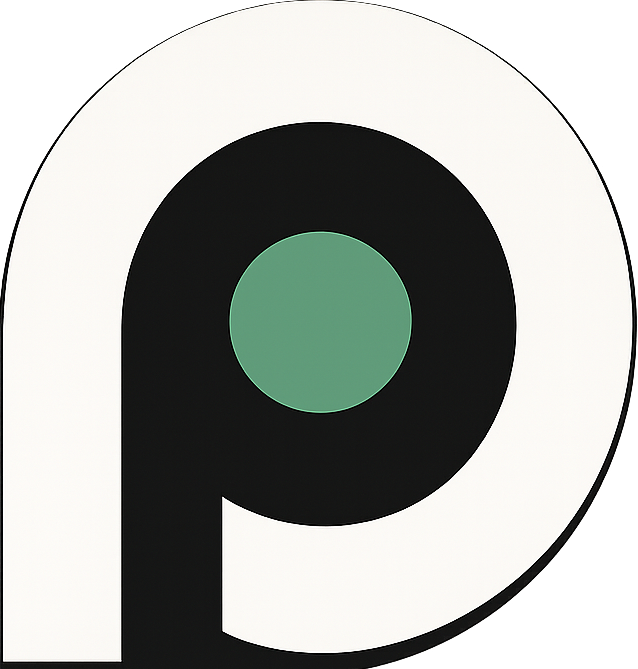

<div align="center">



# Privoo Browser

**A fast, private browser that works for you — not for advertisers.**

Ads and trackers blocked out of the box. No accounts, no sync servers, no telemetry.
Everything you do stays on your device.

[](https://github.com/sharp4real/privoobrowser/releases)
[](LICENSE)
[](https://discord.gg/WweUzF3YCQ)

</div>

---

## Why Privoo

Most browsers monetise your attention. Privoo doesn't. It ships with a serious
content blocker enabled by default, hardens your fingerprint, and keeps every
byte of your browsing data local. There is no account to create and nothing to
opt out of.

- **Private by default** — you shouldn't have to configure privacy; it's on from the first tab.
- **Genuinely fast** — blocking ads and trackers at the network layer means pages load less junk.
- **Yours to shape** — accent colours, layouts, themes, and a set of first-party extensions.

---

## Features

### Privacy & Security

| Feature | What it does |
| --- | --- |
| **Ad & Tracker Blocking** | EasyList, EasyPrivacy and uBlock Origin lists, enforced at the network layer |
| **Custom Filter Lists** | Add your own list URLs, or disable any built-in default (Settings → Privacy) |
| **HTTPS-Only Mode** | Automatically upgrades insecure `http://` connections |
| **Third-Party Cookie Blocking** | Stops cross-site tracking cookies |
| **DNS-over-HTTPS** | Encrypted DNS via Cloudflare, AdGuard, Quad9, NextDNS, Google or a custom resolver |
| **Fingerprint Protection** | Canvas noise (deterministic per-origin), User-Agent normalisation, WebRTC IP-leak protection |
| **Do Not Track & Global Privacy Control** | Sends both privacy signals with requests |
| **Tracking-Param Stripping** | Removes `utm_*`, `fbclid`, `gclid` and friends; minimises the `Referer` header |
| **Proxy & Tor** | Route traffic through a manual proxy or a bundled Tor circuit |
| **Profiles & Guest Mode** | Fully isolated browsing identities, plus a no-history guest session |
| **Family Filtering** | Optional adult-content blocking at the DNS and navigation layers |
| **Password Vault** | Encrypted, local-only credential storage with autofill |

### Built-in Extensions

First-party tools that live on the **Extensions** page — no installing, no third parties.

| Extension | Default | What it adds |
| --- | --- | --- |
| **Privacy Shield** | Always on | Ad, tracker and malware blocking |
| **Downloads** | Always on | Download manager in the toolbar |
| **HTTPS-Only Mode** | On | Automatic secure-connection upgrades |
| **Password Vault** | On | Encrypted local logins + autofill |
| **Privoo AI** | On | AI assistant with saved chat history |
| **Notes** | Off | A quick scratchpad in your toolbar |
| **Calculator** | Off | A full calculator in your toolbar |
| **Media Downloader** | Off | Save video/audio from pages (yt-dlp) |
| **Lucid Mode** | Off | Hover any video for a star + slider that lifts clarity, colour and depth |

Third-party `.crx` / unpacked extensions can also be loaded from the same page.

### Browsing

- **Tabs** — drag-to-reorder, tab groups, and Chrome-style shrink-to-fit sizing
- **Vertical Tabs** — collapsible side panel, icon rail, integrated toolbar, Spotlight-style search
- **Split View** — two pages side by side; drag a tab onto either half of the page to split instantly
- **Privoo AI** — inline panel or full window, backed by *your* key (Anthropic, OpenAI, Gemini, DeepSeek, or a local Ollama model), with a chat-history sidebar
- **Reader, Focus & Mobile View** — strip the clutter, hide the chrome, or emulate a phone
- **Picture-in-Picture & Media Controls** — pop out video, control playback from the toolbar
- **Command Palette** — `Ctrl + K` for everything
- **History, Bookmarks & Downloads** — searchable, local, yours

### Speed Dial (New Tab)

- Clean search bar with live suggestions and your engine's icon
- Optional shortcut tiles, live clock, weather, and privacy stats
- Custom wallpapers (image or live video) and curated animated themes
- Optional **Privoo News** link — release notes rendered locally, never fetched

### Customisation

- **Accent colour** — recolours the entire interface, including page favicons
- **Themes** — light/dark, transparency & glassmorphism (Mica/Acrylic on Windows, vibrancy on macOS)
- **Your Vibe** — an ambient hue gradient washed across the UI
- **Layout** — interface font, corner style, compact mode, font scaling, custom CSS
- **Search engines** — Google, Bing, DuckDuckGo, Brave, Startpage, Ecosia, Qwant, Yandex, Kagi, or custom
- **Discord Rich Presence** with optional theme sync

---

## Installation

**Requirements:** Node.js 16+ and npm.

```bash
npm install      # install dependencies
npm start        # run in development
npm run dist     # build a production installer
```

Prebuilt installers are available on the [Releases](https://github.com/sharp4real/privoobrowser/releases) page. Privoo auto-updates itself.

---

## Keyboard Shortcuts

**Tabs**
`Ctrl+T` new · `Ctrl+W` close · `Ctrl+Shift+T` reopen · `Ctrl+Tab` next · `Ctrl+1–8` jump · `Ctrl+9` last · `Ctrl+Shift+A` search tabs

**Navigation**
`Ctrl+L` address bar · `Ctrl+R` / `F5` reload · `Alt+←` back · `Alt+→` forward

**Features**
`Ctrl+K` command palette · `Ctrl+H` history · `Ctrl+J` downloads · `Ctrl+N` new window · `Ctrl+Shift+N` incognito · `Ctrl+Shift+E` split view · `Ctrl+Shift+R` reader · `Ctrl+Shift+F` focus mode · `F12` dev tools

**Zoom**
`Ctrl +` in · `Ctrl -` out · `Ctrl+0` reset

---

## Architecture

```
privoo/
├── main.js                 # Main process — windows, IPC, ad blocking, privoo:// protocol
├── preload.js              # IPC bridge → window.privoo
├── webview-preload.js      # Internal-page bridge → window.privooInternal
├── settings-store.js       # Settings defaults + persistence
├── profile-store.js        # Browser profiles
├── session-store.js        # Tab session save/restore
├── history-store.js        # History database
├── download-store.js       # Download tracking
├── password-store.js       # Encrypted password vault
├── ai.js                   # Privoo AI backend (provider proxy + key encryption)
├── ytdlp.js                # Media download engine
├── blocklist.js            # Built-in fallback host blocklist
└── renderer/
    ├── index.html          # Browser UI shell
    ├── renderer.js         # Tabs, toolbar, panels, injections
    ├── styles.css          # Interface styles
    └── internal/           # privoo:// pages
        ├── newtab.html     · settings.html   · ai.html
        ├── news.html       · downloads.html  · history.html
        ├── bookmarks.html  · extensions.html · incognito.html
```

**Built on:** Electron · Chromium · [`@ghostery/adblocker-electron`](https://github.com/ghostery/adblocker)

---

## Configuration

Settings live at:

| Platform | Path |
| --- | --- |
| Windows | `%APPDATA%/privoo/privoo-settings.json` |
| macOS | `~/Library/Application Support/privoo/privoo-settings.json` |
| Linux | `~/.config/privoo/privoo-settings.json` |

Selected defaults:

```json
{
  "searchEngine": "brave",
  "adBlocking": true,
  "httpsUpgrade": true,
  "blockThirdPartyCookies": true,
  "dnsOverHttps": true,
  "dohProvider": "cloudflare",
  "canvasSpoofing": true,
  "webrtcProtection": true,
  "doNotTrack": true,
  "accentColor": "#57a97e",
  "darkMode": true,
  "autoUpdates": true
}
```

---

## Troubleshooting

**Ad blocking doesn't seem active** — restart Privoo (filter lists are compiled at launch) and confirm it's enabled in `privoo://extensions/`.

**Video won't play / black frame** — try disabling hardware acceleration in Settings → Performance. Privoo already works around the common GPU cold-start case automatically.

**Downloads not appearing** — check the download folder in Settings and that Privoo has write permission; `privoo://downloads/` shows live status.

---

## Contributing

Pull requests are welcome. Fork the repo, branch off `main`, and open a PR describing what changed and why.

---

## License & Credits

MIT — see [LICENSE](LICENSE).

Built with **Electron** and **Chromium**. Blocking powered by **Ghostery's** adblocker engine and the **EasyList** / **uBlock Origin** filter lists.

## Support

- **Discord** — [join the community](https://discord.gg/WweUzF3YCQ)
- **Issues** — [GitHub Issues](https://github.com/sharp4real/privoobrowser/issues)
- **Discussions** — [GitHub Discussions](https://github.com/sharp4real/privoobrowser/discussions)

---

## Roadmap

- [x] Multiple profiles + Guest mode
- [x] Vertical tabs & Split view
- [x] Built-in AI assistant with chat history
- [x] Custom filter lists
- [x] First-party built-in extensions (Notes, Calculator, Lucid Mode…)
- [ ] Full third-party extension (CRX) support

---

<div align="center">

**Privoo is an independent project. No telemetry. No tracking. No data collection.**

</div>
